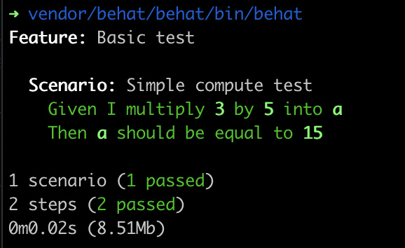

# STEP 3 

Pour assurer la qualité du code, j’utilise plusieurs outils. J’ai travaillé avec PHPStan lors de mon emploi chez Laboratoire Terravita, un outil d’analyse statique qui m’a permis de détecter des erreurs sans exécuter le code. On utilisait aussi PHP-CS-Fixer pour garder un code propre et bien formaté. PHPUnit était utilisé pour les tests unitaires et j’ai également eu l’occasion d’écrire et faire tourner des tests Behat, notamment pour simuler des scénarios fonctionnels en langage naturel.
Pour améliorer le processus de développement, je mettrais en place une CI/CD. D’abord, en configurant un pipeline (comme GitHub Actions ou GitLab CI) qui vérifie automatiquement le code à chaque push. Il lance les tests avec PHPUnit et Behat, vérifie les standards de code avec PHP-CS-Fixer et fait une analyse statique avec PHPStan. Ensuite, si tout est bon, on peut déployer automatiquement vers un environnement de test ou de production.

# Requirements
To run this project you will need a computer with PHP and composer installed.

# Install
To install the project, you just have to run `composer install` to get all the dependencies

# Running the tests
After installing the dependencies you can run the tests with this command `vendor/behat/behat/bin/behat`.
The result should look like this :
